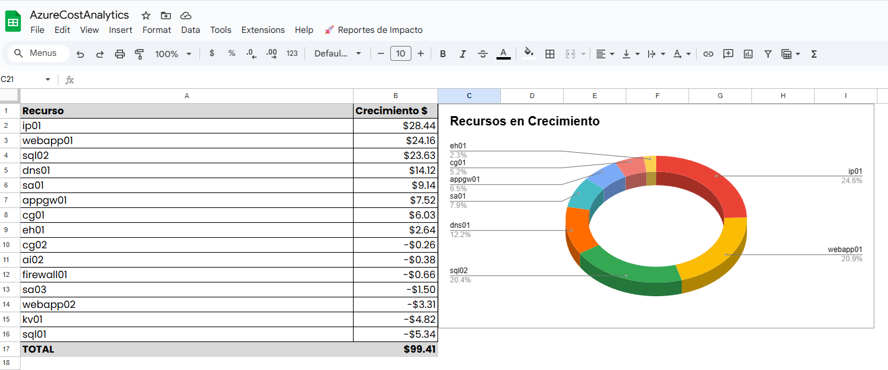
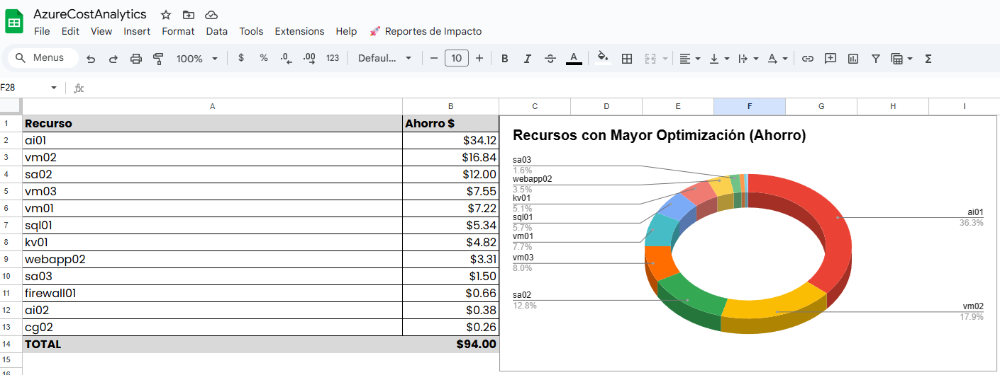

# azure-cost-analytics-gsheets

Automatización profesional para el análisis, visualización y reporte de costos de recursos Azure usando Google Sheets y Google Apps Script.

---

## 📊 Descripción del proyecto

Este proyecto proporciona un script para Google Apps Script que te permite:

- Identificar el **Top 15 de recursos de Azure con mayor crecimiento en costos**.
- Identificar el **Top 15 de recursos con mayor optimización o reducción de costos**.
- Visualizar los resultados en gráficas tipo pastel directamente en Google Sheets.
- Enviar reportes PDF de los resultados por correo electrónico, de forma automática.

---

## 🚀 Características principales

- Menú personalizado en Google Sheets para ejecutar el análisis y generación de reportes.
- Tablas y gráficas generadas automáticamente para facilitar la toma de decisiones.
- Envío automatizado de reportes visuales en PDF.

---

## 🧪 Ejercicio de ejemplo (uso práctico)

Sigue estos pasos para probar el proyecto con datos de ejemplo:

1. **Descarga los archivos de muestra:**
   - [Mes base.csv](Mes%20base.csv)
   - [Mes a comparar.csv](Mes%20a%20comparar.csv)

2. **Importa cada archivo en tu Google Sheets:**
   - Crea una hoja llamada `Mes Base` y sube el archivo **Mes base.csv**.
   - Crea otra hoja llamada `Mes a comparar` y sube el archivo **Mes a comparar.csv**.

3. **Copia el contenido del archivo** `AzureCostAnalytics.gs` **al editor de Apps Script** de tu Google Sheets.

4. **Guarda y recarga tu hoja** para habilitar el menú **🚀 Reportes de Impacto**.

5. Utiliza el menú para generar análisis, gráficas y enviar reportes por correo electrónico.

---

## 📁 Estructura recomendada del repositorio

```plaintext
azure-cost-analytics-gsheets/
├── README.md
├── AzureCostAnalytics.gs
├── Mes base.csv
├── Mes a comparar.csv
├── LICENSE
└── img/
    ├── Recursos_en_crecimiento.png.png
    └── Recursos_con_mayor_optimizacion.png.png
````

---

## 🖼️ Imágenes de ejemplo

A continuación se muestran capturas reales del resultado obtenido al ejecutar el ejercicio de ejemplo:





---

## 📝 Licencia

Este proyecto está bajo la [Licencia MIT](LICENSE).

---

Desarrollado por **Agustin Avila**


---
